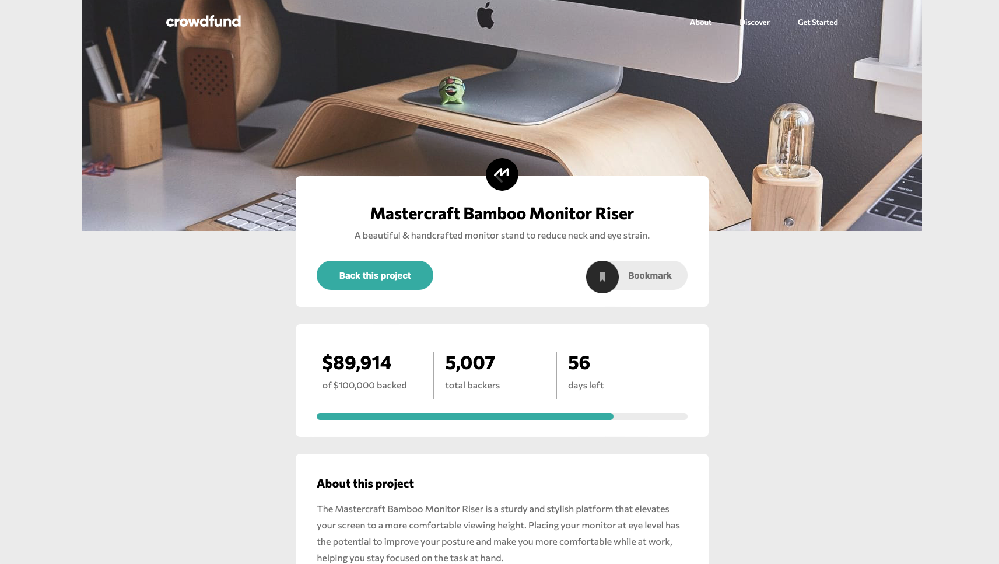
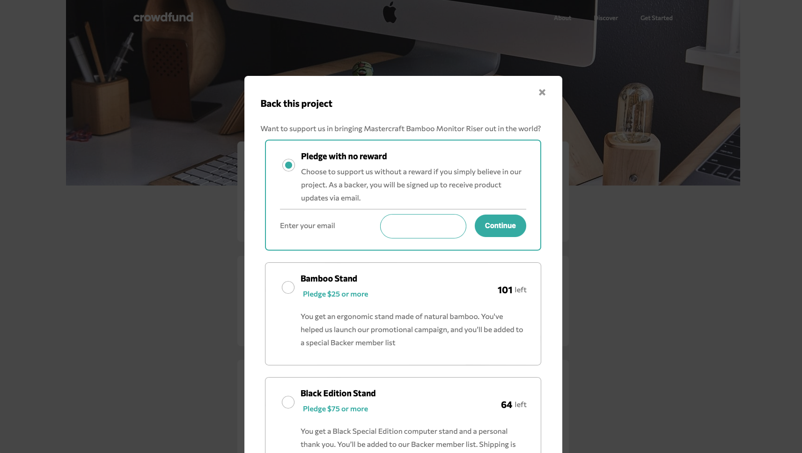
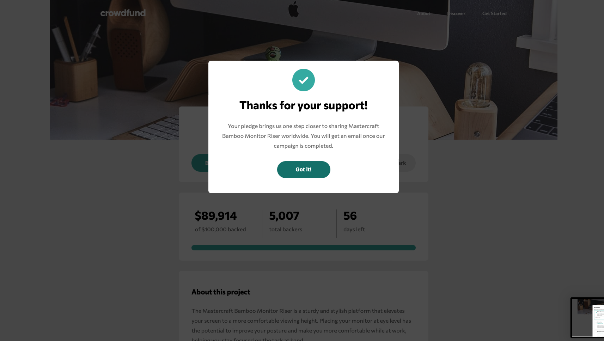

# crowdfund
Crowfund es un ejercicio de maquetación web, incluye 4 ejemplos, 3 utilizando varias metodologías de CSS y 1 mostrando
como consumir una API con JS.

- 7-1
- API
- BEM
- Vanilla CSS

## Uso
Descarga la carpeta `crowfunding` del ejemplo que prefieras.

El sitio web debería mostrarse al abrir el archivo `index.html` en un navegador web.

## IMPORTANTE
- Es necesario tener conexión a internet para que el tipo de font funcione correctamente.
- El proyecto utiliza `SASS` para CSS, es posible que sea necesario instalarlo para el correcto funcionamiento del sitio web.

## Screenshots

